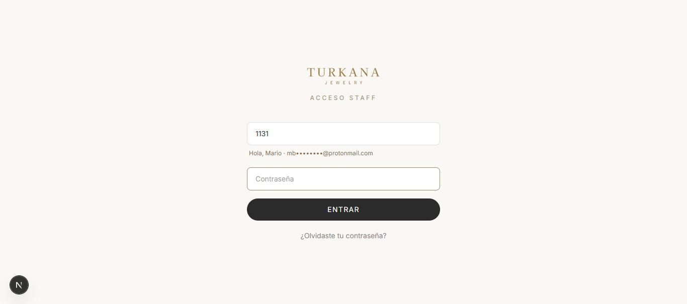
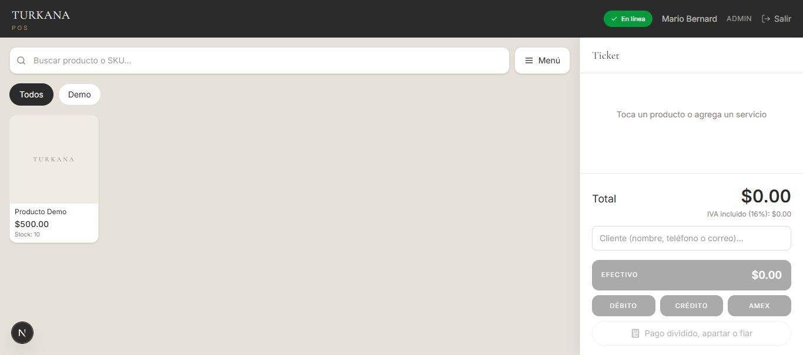
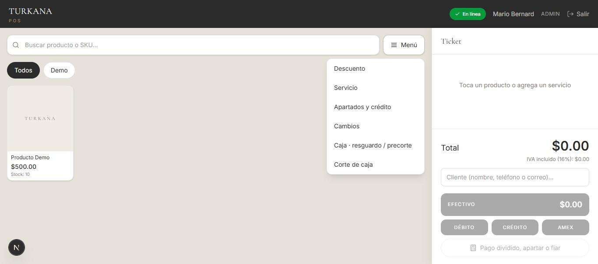
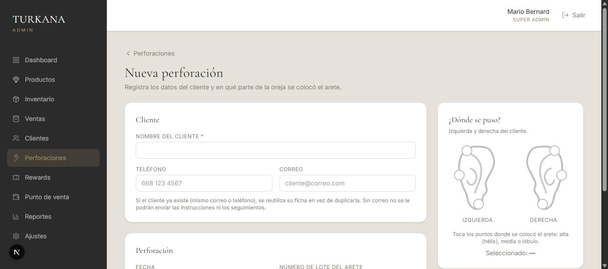
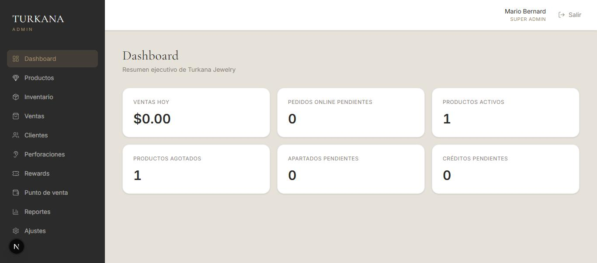
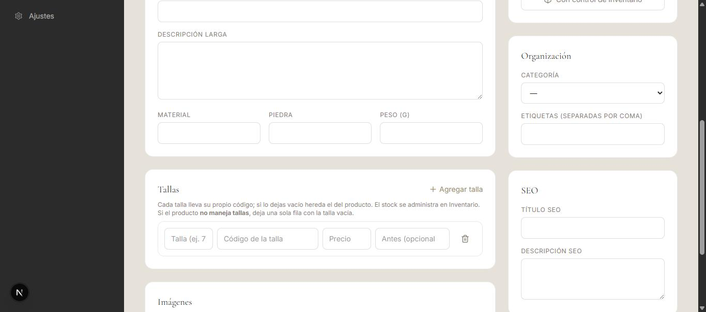
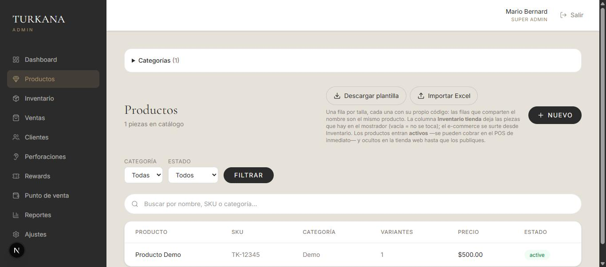
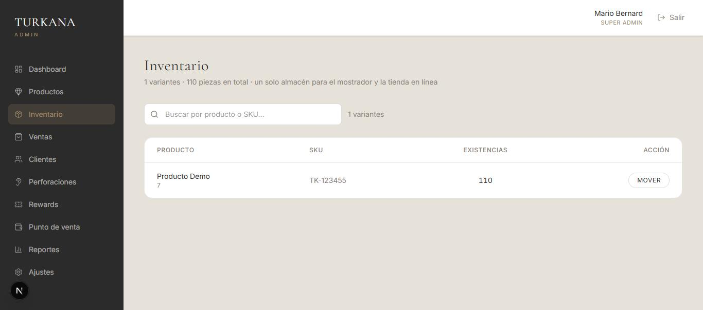
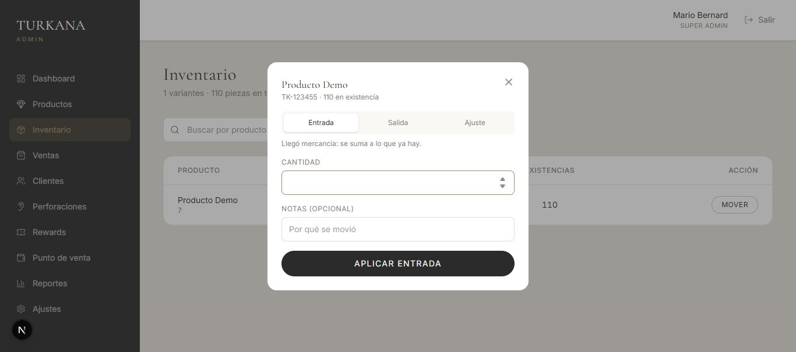

# Manual de uso — Sistema Turkana

**Para el personal de tienda**
Versión 1 · Agosto 2026

---

## Cómo usar este manual

Está ordenado como sucede el día: primero entrar, luego abrir la caja, vender, y al final cerrar. Si eres nuevo, léelo de corrido una vez. Después úsalo para consultar lo que se te olvide.

Cuando veas **negritas** es el nombre exacto de un botón o de un campo en la pantalla.

**Índice**

1. [Qué es el sistema](#1-qué-es-el-sistema)
2. [Entrar al sistema](#2-entrar-al-sistema)
3. [Abrir la caja](#3-abrir-la-caja)
4. [Vender](#4-vender)
5. [Formas de pago](#5-formas-de-pago)
6. [El ticket](#6-el-ticket)
7. [Descuentos](#7-descuentos)
8. [Servicios](#8-servicios)
9. [Apartados](#9-apartados)
10. [Crédito (fiado)](#10-crédito-fiado)
11. [Cambios y devoluciones](#11-cambios-y-devoluciones)
12. [Resguardo de efectivo](#12-resguardo-de-efectivo)
13. [Cerrar la caja (corte)](#13-cerrar-la-caja-corte)
14. [Cuando no hay internet](#14-cuando-no-hay-internet)
15. [Perforaciones](#15-perforaciones)
16. [El panel de administración](#16-el-panel-de-administración)
17. [Dar de alta productos](#17-dar-de-alta-productos)
18. [Inventario](#18-inventario)
19. [Clientes y Rewards](#19-clientes-y-rewards)
20. [Reportes](#20-reportes)
21. [Usuarios del sistema](#21-usuarios-del-sistema)
22. [Problemas comunes](#22-problemas-comunes)
23. [Glosario](#23-glosario)

---

## 1. Qué es el sistema

El sistema de Turkana tiene tres partes que comparten la misma información:

**El punto de venta (POS)** — la pantalla del mostrador. Ahí cobras, haces apartados, devoluciones y el corte de caja al final del día.

**El panel de administración** — donde se dan de alta los productos, se carga el inventario, se ven los reportes y se administran los clientes.

**La tienda en línea** — la página web donde los clientes compran. Se surte de los mismos productos, pero una pieza sólo aparece ahí si alguien la publica a propósito.

Lo importante: **todo está conectado.** Si vendes un anillo en el mostrador, esa pieza se descuenta del inventario al instante y ya no aparece disponible en la web. No hay que avisarle a nadie ni anotar nada aparte.

---

## 2. Entrar al sistema

Cada persona tiene su propia cuenta. **No compartas tu contraseña con nadie**: todo lo que se hace queda registrado a nombre de quien inició sesión, y si algo sale mal se revisa quién lo hizo.

### Pasos

1. Abre el sistema en el navegador (el ícono en la tablet o la computadora del mostrador).
2. Escribe tu **número de empleado**: son cuatro dígitos, por ejemplo `5043`.
3. Al terminar de escribirlo, la pantalla te saluda por tu nombre y muestra parte de tu correo. **Revisa que sea el tuyo.** Si dice otro nombre, te equivocaste de número.
4. El cursor salta solo al campo de la contraseña. Escríbela.
5. Toca **Entrar**.

*Al escribir el número aparece tu nombre y parte de tu correo. Si no es el tuyo, borra y vuelve a escribir.*

> **¿No te sabes tu número?** Pídeselo a la persona que administra el sistema; lo puede ver en Ajustes → Usuarios. También puedes entrar escribiendo tu correo completo en lugar del número, en el mismo campo.

> **¿Olvidaste tu contraseña?** Toca **¿Olvidaste tu contraseña?** abajo del botón y sigue las instrucciones que te llegan por correo.

Si el número o la contraseña están mal, sale el mensaje *"Número de empleado o contraseña incorrectos"*. Es el mismo mensaje en los dos casos, a propósito, para que nadie pueda averiguar qué números existen.

### Cerrar sesión

Al terminar tu turno, **cierra sesión**. Si dejas la sesión abierta, la siguiente persona va a vender con tu nombre y el corte va a salir a nombre tuyo.

---

## 3. Abrir la caja

Antes de poder cobrar hay que abrir el turno de caja. Es lo primero del día.

1. Entra a **Punto de venta**.
2. Si no hay un turno abierto, aparece la pantalla **Apertura de caja**.
3. Elige la **Caja** (si hay más de una).
4. Escribe el **Fondo inicial (efectivo)**: el dinero con el que arranca el cajón. Cuenta los billetes y monedas antes de escribirlo.
5. Toca el botón para abrir.

### Hay un solo turno para toda la tienda

Aunque haya varias personas atendiendo, **el turno de caja es uno solo**, porque el cajón de dinero es uno solo. Si tú llegas y alguien ya abrió la caja, el sistema te mete a ese mismo turno. Eso es correcto: así todo el dinero cobrado en el día entra en el mismo corte, sin importar quién cobró.

No abras y cierres la caja cada vez que cambia la persona en el mostrador. La caja se abre en la mañana y se cierra en la noche.

---

## 4. Vender

La pantalla de venta tiene dos partes: los **productos** a la izquierda y el **ticket** a la derecha.

### Encontrar la pieza

Tienes tres formas:

- **Tocar la foto** del producto en la cuadrícula.
- **Filtrar por categoría** con los botones redondos de arriba (Anillos, Cuff, Cabello…). El botón **Todos** quita el filtro.
- **Buscar** en **Buscar producto o SKU…** escribiendo el nombre o el código de la pieza.

Sólo aparecen las piezas que **tienen existencia en la tienda física**. Si un producto no sale, es que está en cero.

### Agregar al ticket

Toca el producto:

- Si la pieza **tiene tallas**, se abre **Selecciona la talla**. Toca la que va a llevar el cliente. Cada talla tiene su propio código y puede tener su propio precio; abajo de cada una se ve cuántas quedan.
- Si **no tiene tallas**, se agrega directo al ticket.

Cada vez que tocas el producto se suma una pieza más. Para quitar, usa **Quitar** en el renglón del ticket.

El **Total** se actualiza solo. Abajo dice **IVA incluido (16%)**: el precio que ves ya trae el impuesto, no se le suma nada al cobrar. Ese renglón sólo indica cuánto del total es IVA.

### Poner el cliente

Si el cliente está registrado o quiere acumular puntos de Rewards, escribe su nombre, teléfono o correo en **Cliente (nombre, teléfono o correo)…** y tócalo en la lista para engancharlo a la venta. Si no, la venta se hace sin cliente y no pasa nada.

Para apartados y para ventas a crédito **sí es obligatorio** poner el cliente.

---

## 5. Formas de pago

Abajo del ticket están los botones de cobro. Los cuatro de uso diario están a la vista:

**EFECTIVO** (el botón grande) · **DÉBITO** · **CRÉDITO** · **AMEX**

Tocas el que corresponde y la venta se cobra completa con esa forma.

Para todo lo demás está **Pago dividido, apartar o fiar**, abajo:

| Forma | Cuándo se usa |
|---|---|
| **Transferencia** | El cliente transfiere al banco de la tienda. |
| **Rewards** | El cliente paga con los puntos que acumuló. |
| **Crédito (cuenta)** | Fiado: se lo lleva y paga después. Ver [sección 10](#10-crédito-fiado). |
| **Apartado** | Deja anticipo y la pieza se guarda. Ver [sección 9](#9-apartados). |

> **AMEX va aparte** de las otras tarjetas a propósito: la comisión es distinta y en el corte se cuenta por separado. No la registres como crédito.

### Pago dividido

Un cliente puede pagar **con varias formas a la vez**: por ejemplo $500 en efectivo y el resto con tarjeta. Entra a **Pago dividido, apartar o fiar** y ve agregando cada forma con su importe hasta que la suma cubra el total. El sistema no deja cerrar la venta si falta o sobra dinero.

### La calculadora de cambio

Cuando el pago es en efectivo, usa la calculadora:

1. Escribe en **Recibido** con cuánto te pagó el cliente.
2. El sistema te dice el **Cambio a entregar**.
3. Si te dio el importe exacto, toca **Pago exacto**.

Si escribes menos del total, aparece **Falta** en rojo. Sirve para no equivocarte con el cambio cuando hay prisa.

---

## 6. El ticket

Al cobrar sale la pantalla **Venta realizada** con el ticket. Desde ahí lo imprimes o se lo mandas al cliente.

El ticket trae el desglose de **Subtotal**, **Descuento** (si hubo), **IVA (16%)** y **Total**, además del folio de la venta.

**Imprime siempre el ticket del cliente.** Si la impresora falla, la venta ya quedó registrada de todos modos: puedes volver a imprimirla después desde el panel, en **Ventas**.

---

## 7. Descuentos

Todo lo que sigue (descuentos, servicios, apartados, cambios, resguardo y corte) sale del botón **Menú**, arriba a la derecha del buscador:

En ese menú está **Descuento**.

1. Elige si es **Porcentaje %** o **Dinero $**.
2. Escribe la cantidad.
3. Escribe **Autorizado por**: el nombre de quien dio permiso.
4. Escribe el motivo.
5. Toca **Aplicar descuento**.

El campo de quién autorizó no es un trámite: los descuentos salen en el reporte, y ahí se ve quién los autorizó y por qué. **No apliques descuentos sin que alguien te lo autorice.**

Cuando hay un descuento puesto, la opción del menú cambia a **Descuento (aplicado)**.

---

## 8. Servicios

Los servicios son lo que se cobra sin que salga una pieza del inventario: limpieza, reparación, ajuste de anillo, mantenimiento de reloj.

1. Menú → **Servicio**.
2. Elige el servicio de la lista o escribe uno.
3. Agrega una descripción si hace falta (por ejemplo, qué se reparó).
4. Escribe el importe.
5. Toca **Agregar servicio**.

Se suma al ticket como un renglón más y se cobra igual que un producto. Puedes mezclar productos y servicios en la misma venta.

---

## 9. Apartados

Un apartado es cuando el cliente deja un anticipo y la pieza **se guarda** hasta que la termine de pagar.

### Crear el apartado

1. Agrega las piezas al ticket.
2. Menú → **Apartados y crédito** → **Apartar**.
3. Elige el **Cliente** (obligatorio).
4. Escribe el **Anticipo** y con qué **Método del anticipo** lo paga.
5. Pon la **Fecha límite** de pago.
6. Confirma.

Las piezas **quedan reservadas**: se apartan del inventario para que nadie más las venda, pero todavía no cuentan como vendidas.

### Recibir abonos

1. Menú → **Apartados y crédito** → pestaña **Apartados**.
2. Busca al cliente en la lista.
3. Escribe el importe en **Abono** y toca **Abonar**.

Cuando el cliente termina de pagar, toca **Liquidar**. Ahí sí la venta se completa y las piezas salen del inventario.

Si el cliente ya no lo quiere, toca **Cancelar** y las piezas regresan a la venta normal.

---

## 10. Crédito (fiado)

El crédito es cuando el cliente **se lleva la pieza hoy** y paga después.

### Vender a crédito

1. Arma el ticket normal y engancha al cliente.
2. Elige la forma de pago **Crédito (cuenta)**.
3. Aparece **Venta a crédito**: puedes pedir un **Abono inicial (opcional)** o dejarlo en **Sin abono**.
4. Pon la **Fecha límite de pago**.
5. Confirma.

La pieza sale del inventario de una vez, porque el cliente ya se la llevó. Lo que queda pendiente es el dinero.

### Recibir pagos

Menú → **Apartados y crédito** → pestaña **Crédito**. Busca al cliente, escribe el abono y confirma.

Los clientes con **Vencido** en rojo ya se pasaron de la fecha. Cada cliente tiene un **Límite de crédito**: si ya lo alcanzó, el sistema no deja fiarle más.

> **Diferencia entre apartado y crédito:** en el **apartado** la pieza se queda en la tienda hasta que la paguen. En el **crédito** el cliente ya se la llevó. Si te confundes, pregunta antes de cerrar la operación.

---

## 11. Cambios y devoluciones

Menú → **Cambios**.

1. Busca la **Pieza devuelta** por nombre o código.
2. Pon la **Cantidad**.
3. Escribe el **Motivo**.
4. Si es un **Cambio de pieza**, busca la **Pieza nueva** que se lleva el cliente.
5. Si hay diferencia de precio, elige el **Método (diferencia)**: cómo se cobra o se devuelve lo que falta o sobra.

La pieza devuelta **regresa al inventario** automáticamente.

---

## 12. Resguardo de efectivo

Cuando se junta mucho dinero en el cajón, hay que guardarlo en la caja fuerte sin esperar al corte.

Menú → **Caja · resguardo / precorte**.

- **Resguardo**: escribe el **Importe a resguardar** y las **Notas**. Ese dinero sale del cajón y queda registrado, así que el corte de la noche va a cuadrar.
- **Precorte**: un conteo de control a media jornada, sin cerrar el turno.
- **Cambiar cajero**: si te releva otra persona, se anota aquí sin cerrar la caja.

Cuando el efectivo pasa del límite configurado, aparece un **aviso en ámbar** arriba de los productos y la opción del menú se marca con ⚠. **No lo ignores**: es por seguridad, para no tener demasiado dinero en el cajón.

---

## 13. Cerrar la caja (corte)

Es lo último del día. Cuenta el dinero **antes** de empezar.

1. Menú → **Corte de caja**.
2. El sistema muestra los **Cobros registrados**: lo que según él se cobró en cada forma de pago.
3. Escribe lo que **tú contaste**:
   - **Efectivo contado** — cuenta billetes y monedas del cajón.
   - **Débito contado**, **Crédito contado**, **American Express contado** — de los comprobantes de la terminal.
   - **Transferencias**.
4. Escribe las **Personas atendidas**: a cuántas personas atendiste hoy, hayan comprado o no. Sirve para medir cuántos entran y cuántos compran.
5. Revisa la **Diferencia**.
6. Cierra el turno.

### Sobre la diferencia

- **Diferencia en cero**: todo cuadra.
- **Sobra dinero**: puede ser un cambio mal entregado.
- **Falta dinero**: puede ser un cobro no registrado o un error en el cambio.

**No inventes el número para que cuadre.** Escribe lo que realmente contaste. Una diferencia anotada honestamente se puede investigar; una que se maquilló, no. Si la diferencia es grande, avisa antes de cerrar.

El **Efectivo esperado** ya toma en cuenta el fondo inicial y los resguardos que hiciste.

---

## 14. Cuando no hay internet

El punto de venta **sigue funcionando sin internet**. Está hecho para eso.

Arriba de la pantalla hay una etiqueta que dice cómo está la conexión:

| Etiqueta | Qué significa |
|---|---|
| 🟢 **En línea** | Todo normal. |
| 🟡 **Sin conexión** | No hay internet. Puedes seguir cobrando. |
| 🔵 **Sincronizando** / **N en cola** | Volvió el internet y se están subiendo las ventas. |
| 🔴 **Número en rojo** | Hay ventas con problema. Avisa. |

### Qué hacer

**Sigue vendiendo normal.** Las ventas se guardan en la tablet y se suben solas cuando regresa la conexión. El número junto a **Sin conexión** te dice cuántas están esperando.

**Reglas mientras no hay internet:**

- **No apagues ni cierres** la tablet o el navegador hasta que la etiqueta vuelva a **En línea** y ya no haya ventas en cola. Si la cierras antes, esas ventas pueden perderse.
- El inventario que ves puede no estar al día, porque no se está comunicando con las demás pantallas.
- Los apartados, el crédito y las devoluciones **sí necesitan internet**. Si son urgentes, anótalos en papel y regístralos cuando vuelva.

Si aparece un número en rojo, significa que alguna venta chocó al subir (por ejemplo, se vendió la última pieza en dos lados a la vez). **Avisa a administración**, no lo resuelvas por tu cuenta.

---

## 15. Perforaciones

Las perforaciones de oreja se registran en **Perforaciones**, en el panel de administración.

### Registrar una

1. **Perforaciones** → **Nueva**.
2. Escribe el **nombre del cliente**, su **teléfono** y su **correo**. El correo es lo que permite mandarle los cuidados y el seguimiento: pídelo siempre.
3. Pon la **fecha**.
4. Escribe el **número de lote** del arete que usaste. Esto es importante: si después hay una reacción o un problema, es lo que permite saber qué material se usó.
5. En el **dibujo de las orejas**, toca los puntos que perforaste. Son seis: alta (hélix), media y lóbulo, en cada oreja.
6. Agrega **notas** si hace falta.
7. Guarda. El sistema le pone un folio (PF-000001).

*Los puntos se tocan sobre el dibujo. **Izquierda y derecha son las del cliente**, no las tuyas viéndolo de frente.*

> Si el cliente ya existe (mismo correo o teléfono), el sistema **reutiliza su ficha** en vez de crear una repetida.

### Los correos de seguimiento

Cada perforación manda tres correos:

- **Instrucciones de cuidado** — el mismo día.
- **Seguimiento de la primera semana**.
- **Seguimiento del primer mes**.

En la lista de perforaciones se ve quién trae seguimiento pendiente:

| Etiqueta | Significa |
|---|---|
| 🟢 Al corriente | No hay nada que mandar. |
| 🟡 Semanal pendiente | Ya pasó una semana y no se ha mandado. |
| 🔴 Mensual pendiente | Ya pasó un mes. Esto es lo más urgente. |

Abre la perforación y toca el botón del correo que toca. El sistema anota que ya se mandó, así que no se manda dos veces.

Revisa esta lista **una vez por semana**. El cartílago (las perforaciones altas y medias) tarda más en sanar que el lóbulo, y el texto del correo ya lo toma en cuenta solo.

---

## 16. El panel de administración

Se entra en **/admin**. Del lado izquierdo está el menú:

| Sección | Para qué |
|---|---|
| **Dashboard** | Resumen del día. |
| **Productos** | Alta y edición de las piezas del catálogo. |
| **Inventario** | Cuántas piezas hay y dónde. |
| **Ventas** | Todas las ventas hechas; se pueden reimprimir. |
| **Clientes** | Datos, apartados y créditos de cada cliente. |
| **Perforaciones** | Registro y seguimiento. |
| **Rewards** | Puntos de los clientes. |
| **Punto de venta** | Te lleva al POS. |
| **Reportes** | Cortes, movimientos, resultados. |
| **Ajustes** | Usuarios, permisos, datos del negocio, correo y contenido de la web. |

Lo que puedes ver depende de tu rol. Si una sección no te aparece o te dice que no tienes permiso, es normal: pídelo a quien administra.

---

## 17. Dar de alta productos

Hay dos maneras. Para pocas piezas, una por una. Para muchas, el Excel.

### A) Una pieza a la vez

**Productos** → **Nuevo producto**.

**Información**
- **Nombre** — como lo va a ver el cliente.
- **Slug** — se llena solo con el nombre; es la dirección en la web. Déjalo así.
- **Código / SKU** — el código general de la pieza.
- **Descripción corta** y **larga**.
- **Material**, **Piedra**, **Peso (g)** — opcionales.

**Tallas**

Aquí va cada talla en su propio renglón, y **cada talla lleva su propio código**:

| Campo | Qué poner |
|---|---|
| Talla | Por ejemplo `7`. Si la pieza no maneja tallas, déjalo vacío. |
| Código | El código de esa talla. Si lo dejas vacío, hereda el del producto. |
| Precio | El precio de esa talla. Pueden ser distintos entre tallas. |
| Antes | Opcional: el precio anterior, para mostrar la rebaja. |

Usa **Agregar talla** para más renglones. **Si la pieza no maneja tallas, deja un solo renglón con la talla vacía.**

> Dos tallas **no pueden tener el mismo código**, y un código no puede estar repetido en dos piezas distintas del catálogo. Si pasa, el sistema te avisa de quién es ya ese código.

**Imágenes** — arrastra las fotos o toca para subirlas. La primera es la principal.

**Publicación**
- **Estado**: *Borrador* (no se vende), *Activo* (se vende) o *Archivado* (retirado).
- **Destacado**: sale en la portada de la web.
- **Visible / Oculto en tienda web**: si está oculto, sólo se vende en el mostrador.
- **Con / sin control de inventario**: quítalo sólo para cosas que no se cuentan, como bolsas.

**Organización** — categoría y etiquetas. **SEO** — opcional, para que Google encuentre la pieza.

Guarda con **Crear producto**. El stock **no se pone aquí**: se carga en Inventario.

### B) Muchas piezas con el Excel

**Productos** → **Descargar plantilla**. Baja un archivo con las columnas ya puestas y una fila de ayuda en amarillo explicando cada una.

**La regla principal: una fila por talla.** Las filas que comparten el mismo Nombre (o Slug) son la misma pieza.

| Nombre | Slug | Talla | Código (SKU) | Precio | Inventario tienda |
|---|---|---|---|---|---|
| Anillo Turkana | anillo-turkana | 6 | TK-001-6 | 1890 | 3 |
| Anillo Turkana | anillo-turkana | 7 | TK-001-7 | 1890 | 5 |
| Anillo Turkana | anillo-turkana | 8 | TK-001-8 | 1950 | 2 |
| Cuff liso dorado | cuff-liso-dorado | | CUFF-11 | 890 | 4 |

En el ejemplo hay **dos productos**: un anillo con tres tallas y un cuff que no maneja tallas (una sola fila, con la talla vacía).

**Cosas que hay que saber:**

- **Borra las filas de ejemplo** antes de subir tu archivo.
- El **Nombre** se repite en cada talla de la misma pieza.
- Las descripciones, la categoría, las etiquetas y el SEO se escriben **sólo en la primera fila** de cada producto.
- El **Código es obligatorio** en cada fila y no se puede repetir.
- **Inventario tienda** son las piezas que hay. Es la cantidad que hay, no la que entra: si pones 10 y vuelves a subir el mismo archivo, quedan 10, no 20. Si dejas la celda **vacía**, el inventario no se toca. Como hay **un solo almacén**, esas piezas quedan disponibles igual en el mostrador que en la tienda en línea.
- Si la **categoría** no existe, se crea sola.

Sube el archivo con **Importar Excel**. Al terminar sale un resumen verde: cuántos productos se crearon, cuántos se actualizaron, cuántas tallas nuevas y en cuántas se cargó inventario. **Lee los avisos en amarillo**: son las filas que se saltaron y por qué.

Las piezas entran **activas** —se pueden cobrar en el POS de inmediato— y **ocultas en la tienda web**, hasta que alguien las publique con fotos y textos revisados.

---

## 18. Inventario

**Hay un solo almacén.** Las piezas que cargas aquí son las mismas que ve el mostrador y las mismas que ve la tienda en línea. No hay que pasar nada de un lado a otro ni reservar existencias para la web: si hay 10 piezas, hay 10 para quien llegue primero.

**Inventario** muestra cada talla con sus **Existencias**:

*Debajo del nombre del producto va la talla. Un número en rojo significa cero piezas.*

Cuando hay piezas comprometidas en apartados o en pedidos de la web, aparecen dos columnas más: **Apartadas** (las que ya tienen dueño) y **Disponibles** (las que realmente se pueden vender).

### Movimientos

Toca **MOVER** en el renglón de la talla. Se abre una ventana con tres pestañas:

Elige la pestaña, escribe la **cantidad** y las **notas**, y toca el botón de abajo. Debajo del campo el sistema te adelanta en cuánto va a quedar, y si intentas sacar más de lo que hay te lo dice en rojo antes de aplicarlo.

| Movimiento | Cuándo se usa |
|---|---|
| **Entrada** | Llegó mercancía nueva. **Suma** a lo que hay. |
| **Salida** | Salió algo que no fue una venta (una pieza dañada, una muestra). **Resta**. |
| **Ajuste** | Después de contar físicamente. **Fija la cantidad exacta**, no suma ni resta. |

Cuidado con la diferencia: si hay 5 piezas y haces una **entrada** de 3, quedan 8. Si haces un **ajuste** de 3, quedan 3.

Escribe siempre la nota de por qué. Todos los movimientos quedan registrados con tu nombre y se ven en **Reportes → Movimientos**.

Cuando una pieza baja del mínimo, el sistema manda un aviso a administración.

---

## 19. Clientes y Rewards

En **Clientes** está la ficha de cada persona: sus datos, sus compras, sus apartados y su crédito. Puedes buscar por nombre, correo o teléfono — el teléfono lo encuentra lo escribas como lo escribas, con o sin espacios.

**Rewards** es el programa de puntos: el cliente acumula por lo que compra y después lo usa como forma de pago. Para que acumule, hay que **engancharlo a la venta** antes de cobrar. Si se te olvida, esa compra no le suma.

Los puntos vencen. En la ficha del cliente se ve su saldo y cuándo caduca.

---

## 20. Reportes

**Reportes → Cortes** — el histórico de los cortes de caja, con las diferencias de cada uno. Arriba salen los turnos que quedaron abiertos sin cortar.

**Reportes → Movimientos** — todo lo que entró y salió del inventario, con quién y cuándo.

**Dashboard** — el resumen del día: cuánto se vendió, en qué formas de pago, y las piezas que se están acabando.

---

## 21. Usuarios del sistema

*(Sólo para administradores.)* **Ajustes → Usuarios**.

**Crear a alguien**: toca **Nuevo usuario** y llena nombre, correo, contraseña, rol y —si quieres— su número de empleado. Si dejas el número vacío, el sistema le asigna uno y te lo dice al terminar. **Anótalo y dáselo**: es con lo que va a entrar.

**Cambiar el número**: escríbelo en la columna **N.º empleado** y sal del campo. El botón de recargar al lado le asigna uno nuevo al azar, para cuando alguien más ya se aprendió el suyo.

**Roles**: cada uno ve y puede hacer cosas distintas. Se ajustan en **Ajustes → Permisos**.

**Dar de baja**: toca **Activo** para desactivar a la persona. Deja de poder entrar pero se conserva todo su historial de ventas. **Es mejor desactivar que eliminar.**

---

## 22. Problemas comunes

**No puedo entrar.**
Revisa que el número sea el tuyo: al escribirlo debe salir tu nombre. Si sale otro nombre, es de alguien más. Si no sale ninguno, ese número no existe.

**No aparece un producto en el punto de venta.**
Tres razones posibles: está en **cero** en tienda, su estado es **Borrador** o **Archivado**, o se dio de alta pero no se le cargó inventario. Revísalo en Inventario y en Productos.

**No hay categorías arriba de los productos.**
No hay categorías dadas de alta todavía. No impide vender.

**El sistema no me deja cobrar una pieza.**
Si dice *"Producto no encontrado"*, esa pieza ya no existe en el catálogo. Recarga la pantalla; si sigue apareciendo, avisa.

**Dice que no hay stock suficiente.**
Otra pantalla vendió la última pieza antes que tú. Cuenta físicamente y ajusta el inventario.

**La diferencia del corte no cuadra.**
Vuelve a contar. Revisa que hayas registrado los resguardos. Si sigue sin cuadrar, **anota el número real** y avisa: no lo maquilles.

**La etiqueta dice "Sin conexión".**
Sigue vendiendo. No cierres la tablet hasta que vuelva a **En línea** y no queden ventas en cola.

**Se fue la luz a media venta.**
La venta no se cobró. Al volver, revisa en el panel **Ventas** si quedó registrada antes de repetirla, para no cobrar dos veces.

---

## 23. Glosario

**Apartado** — El cliente deja un anticipo y la pieza se guarda en la tienda hasta que la termine de pagar.

**Corte de caja** — El conteo del final del día: se compara lo que el sistema dice que se cobró contra lo que realmente hay.

**Crédito (cuenta)** — Fiado. El cliente se lleva la pieza hoy y paga después.

**Fondo inicial** — El dinero con el que arranca el cajón en la mañana.

**Precorte** — Un conteo de control a media jornada, sin cerrar el turno.

**Resguardo** — Sacar dinero del cajón y guardarlo en la caja fuerte, dejándolo registrado.

**Rewards** — El programa de puntos de los clientes.

**SKU / Código** — El código que identifica una talla en particular. Cada talla tiene el suyo y no se repite.

**Slug** — La dirección de la pieza en la página web.

**Talla / Variante** — Cada versión de un producto. Un anillo en tallas 6, 7 y 8 son tres tallas del mismo producto, cada una con su código, su precio y su inventario.

**Turno** — El periodo entre que se abre y se cierra la caja. Es uno solo para toda la tienda.

---

## Reglas de oro

1. **Cada quien entra con su cuenta.** Nunca con la de otra persona.
2. **Cuenta el dinero antes de escribirlo**, tanto al abrir como al cerrar.
3. **Anota la diferencia real** del corte, aunque no cuadre.
4. **No apliques descuentos** sin autorización, y escribe quién lo autorizó.
5. **Sin internet se sigue vendiendo**, pero no cierres la tablet hasta que suban las ventas.
6. **Pide el correo** en las perforaciones y anota el número de lote.
7. **Si algo se ve raro, pregunta** antes de cerrar la operación.

---

*Sistema Turkana · Manual para el personal de tienda · Versión 1, agosto 2026*
